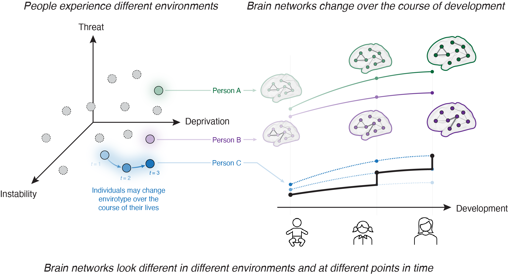
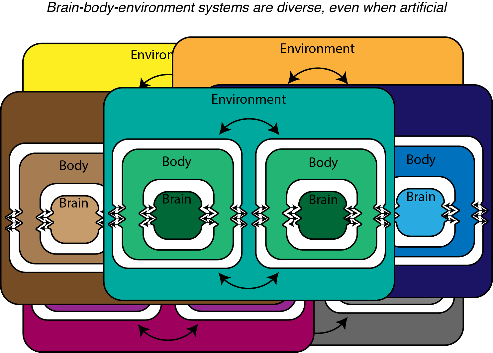

I am interested in the origins and outcomes of sociality with an emphasis on experience, environment, interaction, and dynamics. My work approaches brain science from a humanistic perspective, drawing from biological theory and complex systems science methods, with consequences for the social sciences. 

To approach this multi-faceted phenomenon, I pursue two angles of research simultaneously: (1) I identify how human brain network organization varies across social environmental experiences over the lifespan using cutting edge analyses from network science and (2) I investigate foundational principles and assumptions of social interaction with dynamical models of interacting artificial agents. I leverage big data from openly available datasets to appeal broadly to human experience as well as computer simulations to facilitate ground truth understanding. Across both angles, I aim to innovate on existing methods to more effectively answer my research questions. Below you'll find a selection of some of my work, and for the projects I'm first author on I provide highlights :) If you are interested in one of my papers but unable to access it for any reason, feel free to email me!

## Related to Network Neuroscience

**Merritt, H.**, Koch, M.K., Youngheun, J., Chumin, E., & Betzel, R.F. (2024). Social 'envirotyping' the ABCD study contextualizes dissociable brain organization and diverging outcomes. Social Cognitive and Affective Neuroscience. [Link to preprint](https://www.biorxiv.org/content/10.1101/2024.08.20.608873v1.full.pdf).

* **Highlights of Merritt et al., 2024:** We identified different patterns of social environment experience (i.e., "envirotypes"), by hierarchically clustering subjects from the Adolescent Brain Cognitive Development Study. We then applied tools from network neuroscience to show how patterns of whole brain connectivity varied across envirotypes. Differences were distributed across the brain but were especially prominent in Default and Somatomotor Hand systems. Finally, we examined how envirotypes change over development and how these patterns of change are associated with a suite of outcomes. The resulting dynamic envirotypes suggested the dominant patterns of change are high quality stability, instability, improvement, and worsening. The outcomes of the stable envirotype were most easily distinguished from those of the improving envirotype, while the unstable envirotype had the worst outcomes.

**Merritt, H.**, Mejia, A., & Betzel, R.F. (In Review). The dual interpretation of edge time series: Time-varying connectivity versus statistical interaction. iScience. [Link to preprint](https://www.biorxiv.org/content/10.1101/2024.08.29.609259v1.full.pdf)

* **Highlights of Merritt et al., 2024:**  Recently, we developed a technique for tracking rapid (framewise) fluctuations in network connectivity over time. Here, we show that these “edge time series” are mathematically equivalent to interaction terms in a specific family of general linear models. We exploit this fact to further demonstrate that time-varying connectivity carries explanatory power above and beyond brain activations, suggesting that time-varying connectivity is likely more than a statistical artifact.

**Merritt, H.**, Rakesh, D., & Betzel, R.F. (In Review). Connection & Context: The Neural Architecture of Social Relationships. Trends in Cognitive Science.

* **Highlights of Merritt, Rakesh, & Betzel:** We outline how brain network organization varies across different social environments, with an eye toward cutting edge methodological techniques that clarify the consequences of this variation for studying human health, behavior, and cognition.

**Merritt, H.**, Hughes, C., French, R., Betzel, R.F., & Krendl, A. (In Prep). Multivariate associations between social environment and functional connectivity in older adults.

* **Highlights of Merritt et al.:** We examine associations between functional brain network connectivity and social support and social network organization in older adults.
  

**Merritt, H.**, Lewis, G., & Betzel, R.F. (In prep). Implications of Human Sociality for Neuroscience.

* **Highlights of Merritt et al.:** Our relationships and the support we receive from them impact every facet of our health and wellbeing, yet traditional individualistic approaches to human social neuroscience fall short of capturing how and why this is the case. We review recent literature across subfields of social neuroscience and argue for a shift in perspective that centers sociality.

* Poetto, S., **Merritt, H.**, Santoro, A., Rabuffo, G., Battaglia, D., Vaccarino, F., Saggar, M., Brovelli, A., & Petri, G. (2025). The topological architecture of brain identity. bioRxiv. [Link to preprint][https://www.biorxiv.org/content/biorxiv/early/2025/06/21/2025.06.20.660792.full.pdf]

French, R., Hughes, C., **Merritt, H.**, Betzel, R.F., & Krendl, A. (In Prep). Naturalistic theory of mind measurement localized neural activity and connectivity within single model framework.

**Merritt, H.**, Faskowitz, J., Gonzalez, M.Z., & Betzel, R.F. (2024). Stability and variation of brain-behavior correlation patterns across measures of social support. Imaging Neuroscience. [Link to PDF](https://direct.mit.edu/imag/article/doi/10.1162/imag_a_00133/120372). [Preprint](https://doi.org/10.1101/2023.03.23.533966)

* **Highlights of Merritt et al., 2024:** We apply multilayer modeling and modularity maximization to jointly cluster patterns of brainbehavior associations for seven social support measures. We find that the cluster structure of brain-behavior association studies in subcortical and control systems are especially sensitive to different constructs of perceived social support. Network nodes in these systems are highly flexible; their community affiliations differ across social support measures.  The multilayer approach enables direct comparison of the roles of all regions of the brain
across all social support measures simultaneously, offering a generalizable technique for studying the stability brain-behavior correlations that can be applied in other contexts, such as cognition, behavior, and health.

Chumin, E., Faskowitz, J., Esfahlani, F.Z., **Merritt, H.**, Tanner, J.C., Cutts, S., Pope, M., Betzel, R.F., & Sporns, O. (2022). Cortico-Subcortical Interactions in Overlapping Communities of Edge Functional Connectivity. NeuroImage, 250, 118971. [Link to PDF](https://www.sciencedirect.com/science/article/pii/S1053811922001008)

Esfahlani, F.Z., Jo, Y., Puxeddu, M.G., **Merritt, H.**, Tanner, J.C., Greenwell, S., Patel, R., Faskowitz, J., & Betzel, R.F. (2021). Modularity maximization as a flexible and generic framework for brain network exploratory analysis. NeuroImage, 244, 118607. [Link to PDF](https://www.sciencedirect.com/science/article/pii/S1053811921008806)

## Related to Artificial Life

**Merritt, H.**, Severino, G.J., & Izquierdo, E.J. (In prep). There Are Many Ways to Be Social: Characterizing Behavioral and Neural Dynamic Diversity of Virtual Social Agents.

* **Highlights of Merritt et al.:** The perceptual crossing paradigm challenges methodological individualism by demonstrating that successful interactions cannot be explained by the behavior or neural dynamics of the individual. Here, we investigate the diversity of individual behavioral strategies and neural dynamics that are a part of successful interactions in evolved social agents. 

**Merritt, H.**, Severino, G., & Izquierdo, E. (2023). The Dynamics of Social Interaction among Evolved Model Agents. Artificial Life 29(4), 1-24. [Link to PDF:](https://pubmed.ncbi.nlm.nih.gov/37988679/)

* **Highlights of Merritt et al., 2023:** We offer three advances to the perceptual crossing simulation studies, which are aimed at challenging methodological individualism in the analysis of social cognition. First, we evolve and systematically test agents in rigorous conditions, identifying a set of 26 "robust circuits" with consistently high and generalizing performance. Next, we transform the sensor from discrete to continuous, facilitating a bifurcation analysis of the dynamics that shows that nonequilibrium dynamics are key to the mutual maintenance of interaction. Finally, we examine agents' performance with partners whose neural controllers are different from their own and with decoy objects of fixed frequency and amplitude. Altogether, our findings accentuate the importance of dynamical and nonclonal analyses for simulated sociality, emphasize the role of dialogue between artificial and human studies, and highlight the contributions of simulation studies to understanding social interactions.

Severino, G., **Merritt, H.**, & Izquierdo, E. (2023). Between you and me: A systematic analysis of mutual social interaction in perceptual crossing agents. ALIFE 2023: Proceedings of the 2023 Conference on Artificial Life. [Link to PDF](chrome-extension://efaidnbmnnnibpcajpcglclefindmkaj/https://watermark.silverchair.com/isal_a_00609.pdf?token=AQECAHi208BE49Ooan9kkhW_Ercy7Dm3ZL_9Cf3qfKAc485ysgAAAz8wggM7BgkqhkiG9w0BBwagggMsMIIDKAIBADCCAyEGCSqGSIb3DQEHATAeBglghkgBZQMEAS4wEQQM51FgWmEAjI9jSzKDAgEQgIIC8uR-U36eF2zL3fl5hBWcgWCF2s0GpFMzLecgJ-K9GvnXQoYn2NMhHFlXwoBz_TyrV1Lc3LDw0IZDIR2JTs8nLxW4a3pO4PcCXln93nz4Du_uPFRMvQ5sF-GfJIhgNb6LwBV2OfqhYVJyCkjilCmeMuQWEGr1YTJ2KUOIQZcSK_ysijfZCjT2uDmrQNo0kFccBksszypWzidALk9X0vNKrBS52eEaDvxmvSCYq3R0hvX-u3F7MIFv_surK3Ouowg1OFotATy0yEfwM7RQ1hhHunJZBKNf_sFx6QpptjX7lFs7pMCHhTMqGHm2E3L51zliIVoPl0T23upRuibQgQKvbmLYqm0IQe31oeUgkwewSwpZsrPbNfQOt--OnlEBymYkFh4awweINRr_ADYMIpWIKfVUmV3rj5pYJ5E_1d3fZqGHgYwYaK7JFnu1PB1ghsc-WXrIQxLtRgSwGihaPJMpuctaOrccE9xD4BbL8XPipnooV8G_O2rMM9G2p47wsk4iQnz0ojGo0QYCj9uG2JHLH3wnZMEk_DNYQFn_1L4sIM8AxiN1fXzCasDRF27IPQRvJh_TdHl24zXca4VFaeR2lpW3prnArbYVSbRV3j150sd7q8NvwKhgUxysQ-GsecFTBwGwsEADalqcJcIdBhpc8uP9LE9AeqwgTYatMBg9JW3updCyfb0b9MJlAGS6b1iUfhUl3VKhpIQeoGbir_SPCJieltUvMp2KiBaT40ODswIfOKP2oXSucyP9G3ubjRKhHumBcliY6SJpfGPI7q_xMdwR_Yfpb5r0LeRZ5xgNtnKcjStICe3IgUbOeaMzdabaWh_gMBEgcKF1KHTU8zeHPBsX1bb7q39YLw-Taq5Ls3chgAuFNKyhhA64tQ-hjhqHFKNq-ysOryljMM47LUknwTS8OERjRRbJuTasFv0fgG05zn9FYvq9zKZRsjMIMVJW2ERBZeGU7Jxk-Gc4BBGCzr_Ix3POkQVSejyrK7T35wKOc-c)

Izquierdo, E., Severino, G., & **Merritt, H.** (2022). Perpetual Crossers without Sensory Delay: Revisiting the Perceptual Crossing Simulation Studies. ALIFE 2022: Proceedings of the 2022 Conferences on Artificial Life. [Link to PDF](chrome-extension://efaidnbmnnnibpcajpcglclefindmkaj/https://par.nsf.gov/servlets/purl/10346668)

## Notable Collaborations
Nomura, K., Rella, S., **Merritt, H.**, Bird, D., Baltussen, M., & Falk, D. (2024). Tipping Points of Space Debris in Low Earth Orbit. International Journal of the Commons, 18(1), 17-31. DOI: 10.5334/ijc.1275. [Link to PDF](https://thecommonsjournal.org/articles/10.5334/ijc.1275)

Koch, M.K, **Merritt, H.**, McCormick, K., Inniss-Thompson, M., Mendle, J. (2025). Are You There, God? It’s Me, Gender Stereotypes in Coming-of-Age Novels. Journal of Research on Adolescence.

Koch, M.K., **Merritt, H.**, & Mendle, J. (In Review). Sanitized and sexualized: Text Comparison of Puberty in ChatGPT, Television, and Youth. Journal of Youth and Adolescence.

